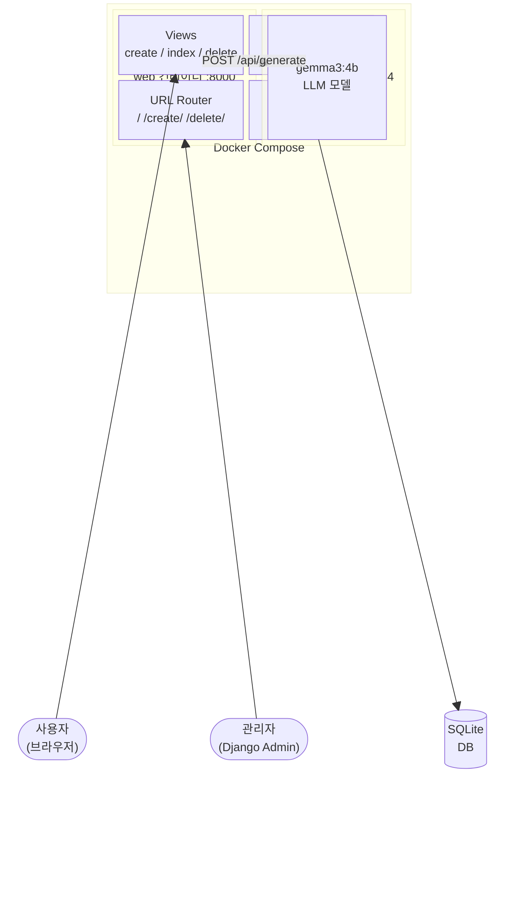

# AI 일기장 (ai-diary)

> 짧은 메모를 입력하면 AI가 감성적인 한국어 일기로 변환해주는 웹 애플리케이션


## 주요 기능

- **AI 일기 변환** - 짧은 메모를 입력하면 Ollama(gemma3:4b) 모델이 감성적인 한국어 일기로 변환
- **일기 목록 조회** - 변환된 일기를 최신순으로 조회
- **일기 삭제** - 불필요한 일기 삭제
- **로딩 애니메이션** - AI 변환 중 로딩 상태 표시
- **Django Admin** - 관리자 페이지에서 DB 데이터 확인 및 관리

## 시스템 아키텍처



## 프로젝트 구조

```
ai-diary/
├── docker-compose.yaml
├── README.md
└── django/
    ├── dockerfile
    ├── manage.py
    ├── requirements.txt
    ├── db.sqlite3
    ├── config/
    │   ├── __init__.py
    │   ├── settings.py
    │   ├── urls.py
    │   ├── asgi.py
    │   └── wsgi.py
    └── diary/
        ├── __init__.py
        ├── admin.py
        ├── apps.py
        ├── models.py
        ├── views.py
        ├── urls.py
        ├── tests.py
        ├── migrations/
        │   ├── __init__.py
        │   └── 0001_initial.py
        └── templates/diary/
            ├── index.html
            └── create.html
```

## 실행 방법

### 사전 준비

- Docker & Docker Compose 설치
- WSL2 환경 (GPU 사용 시 NVIDIA Container Toolkit 설치)

### 1. 프로젝트 클론

```bash
git clone https://github.com/<username>/ai-diary.git
cd ai-diary
```

### 2. Docker Compose로 실행

```bash
docker-compose up -d
```

### 3. Ollama 모델 다운로드

```bash
docker exec -it ai-diary-ollama ollama pull gemma3:4b
```

### 4. Django 마이그레이션

```bash
docker exec -it ai-diary-web python manage.py migrate
```

### 5. 관리자 계정 생성 (선택)

```bash
docker exec -it ai-diary-web python manage.py createsuperuser
```

### 6. 접속

| 서비스 | URL |
|--------|-----|
| 웹 애플리케이션 | http://localhost:8000 |
| Django Admin | http://localhost:8000/admin |
| Ollama API | http://localhost:11434 |